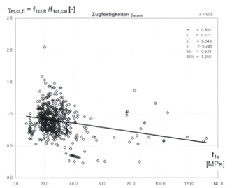

::: {layout="[3,2]"}
Mit dem Heft 597 des DAfStb existiert eine umfassende Datenbank zu
Querkraftversuchen von Stahlbetonbauteilen mit und ohne Bügelbewehrung. Ein Teil
dieser Versuche, die nach bestimmten Kriterien ausgewählt wurden, ist Grundlage für
die zur Zeit gültige halb-empirische Bemessungsgleichung nach EC2.
Im Rahmen dieser Studienarbeit soll ein C#-Programm entwickelt werden, mit dem
die vorliegenden Daten aus den Versuchen ausgewertet und mit gängigen
Bemessungsverfahren verglichen werden können.

{height=50mm}
:::

Die Aufgabenstellung gliedert sich in zwei Teilaufgaben, die jeweils von zwei oder
drei Studierenden bearbeitet werden sollen.

**Teil A:** Zur Auswertung der Einflüsse verschiedener Parameter auf die
Querkrafttragfähigkeit ist ein Analyseprogramm zu entwickeln, mit dem
Versuchsergebnisse aus der Datenbank nach bestimmten Kriterien ausgewählt werden
können und Abhängigkeiten von Versuchsparametern im Diagrammstil zwei- und
dreidimensional dargestellt werden können. Die Auswahl sollte dokumentiert werden,
d.h. z.B. dass Auswahlkriterien, Anzahl und Autor der Versuche dokumentiert werden.
Alle Daten der Auswahl sollten zudem zur externen Weiterverarbeitung exportiert
werden können.

**Teil B:** Des Weiteren sollen in dem Programm verschiedene Verfahren zur
Ermittlung der Querkrafttragfähigkeit eingepflegt und deren Ergebnisse mit der
jeweiligen Auswahl der Versuchsergebnisse verglichen werden können. Der Vergleich
besteht in einer kurzen statistischen Auswertung zur Überprüfung der
Modellsicherheit. Auch hier sollte die Möglichkeit bestehen, verschiedene
Versuchsparameter (oder auch deren Kombination) im Diagrammstil zwei- oder
dreidimensional darstellen zu können.
