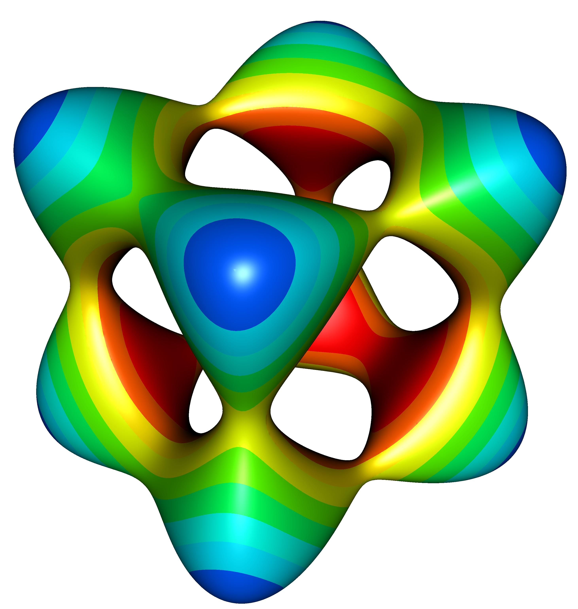

Die Geschwindigkeiten von Longitudinal- und Transversalwellen in einem anisotropen
elastischen Medium hängen von den 21 unabhängigen Einträgen des vierstufigen
Elastizitätstensors ab. Ziel dieser Studienarbeit ist es, diese Geschwindigkeiten
in Abhängigkeit von der Ausbreitungsrichtung grafisch darzustellen. Die
entsprechende Fläche im Raum der Geschwindigkeiten
$v_{qP}(\theta, \phi), v_{qS1}(\theta,\phi), v_{qS2}(\theta,\phi)$
wird dabei implizit durch alle Lösungen der zugehörigen Christoffel-Gleichung
definiert.

{width=60mm}

Mithilfe des Visualization Toolkits VTK lassen sich solche implizit definierten
Flächen in einfacher Weise darstellen. Die Abbildung zeigt die Fläche aller
Lösungen der Gleichung
$0.95 x^4 + 1.2 y^4 + z^4 -(x^2 + y^2 + z^2) + 0.4 = 0$,
wobei die Farbe der Fläche dem Abstand der Lösungspunkte vom Nullpunkt entspricht.

Funktionsumfang des zu erstellenden Programms:

- Eingabe der elastischen Materialparameter
- Auswahl der Wellenart $qP, qS_1$ bzw. $qS_2$
- Visualisierung der Ausbreitungsgeschwindigkeiten mit VTK
