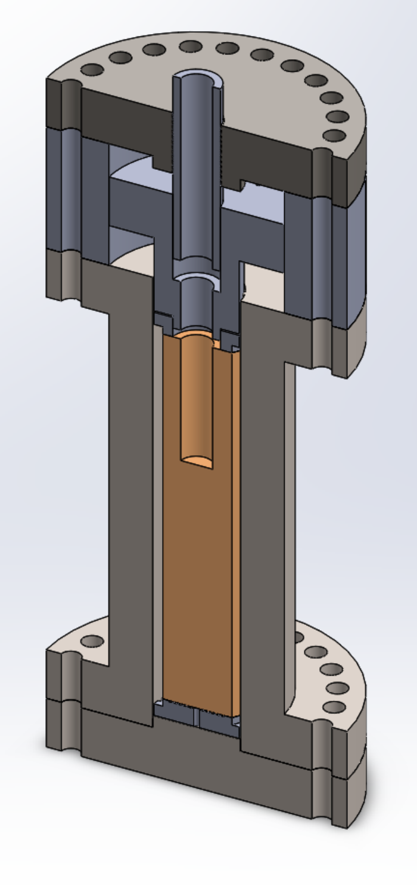

::: {layout="[3,2]"}
Für geothermische Anwendungen ist eine großskalige Apparatur notwendig, die es
erlaubt, den Bohr- und Produktionsprozess während der Erschließung und Nutzung
geothermischer Reservoire zu simulieren. Dazu soll eine zylindrische Gesteinsprobe
beliebiger Dimension in einer Triaxialapparatur in-situ Bedingungen, also Druck-
und Temperaturbedingungen großer Tiefen bis 5 km, ausgesetzt werden. Eine
Triaxialapparatur simuliert den Spannungszustand, dem ein Gestein im Untergrund
ausgesetzt ist (Manteldruck). Zur Vereinfachung wird davon ausgegangen, dass ein
allseitig gleicher, sogenannter isostatischer Druckzustand herrscht. Währenddessen
kann ein Bohrgerät auf das Kopfende der Gesteinsprobe wirken und dort realitätsgetreu
einen ebenfalls zylindrischen Hohlraum schaffen. In diesem Hohlraum herrscht ein
Fluiddruck, der den Druck der Bohrspülung nachstellen soll.

{width=45mm}
:::

Zur Konstruktion der Apparatur ist es wichtig, die Spannungszustände in der Apparatur
zu kennen und ein optimales Verhältnis zwischen Probengröße und Spannungsanforderungen
zu ermitteln. Systematisch müssen also zwei Belastungszustände überprüft werden:

1. Der Spannungszustand, dem die zylindrische Probe mit (entsprechend kleinerem)
   zylindrischem Bohrloch an der Innen- und Außenwand ausgesetzt ist.
2. Der Spannungszustand, dem der Druckbehälter ausgesetzt ist.

Realistische Drücke für Tiefen bis 5 km ergeben sich aus der Druck-Tiefen-Formel.
Für den Fluiddruck innerhalb des Bohrlochs können Maximaldrücke bis 80 MPa
angenommen werden. Für den triaxialen Spannungszustand sind bis zu 150 MPa
realistisch.

Im Rahmen der Studienarbeit soll eine Java-Applikation mit folgendem Funktionsumfang
realisiert werden:

1. Erstellen eines Makros mit den folgenden Eingangsparametern: Probendimension
   (Durchmesser, Länge, Länge >> Durchmesser), Durchmesser Bohrloch, Manteldruck,
   Fluiddruck, Dimension des Druckbehälters (Innen- und Außendurchmesser, Länge).
2. Erstellen einer Skizze des Druckbehälters mit integrierter Probe.
3. Bestimmung des relevanten Spannungsprofils innerhalb der Gesteinsprobe sowie
   innerhalb des Druckbehälters und grafische Darstellung im Profil
   (Literaturrecherche).
4. Auswahl der relevanten Parameter des Materials für Gesteinsprobe und Druckbehälter
   (aus vorgegebener Datenbank oder frei wählbar).
5. Überprüfung, ob Gestein bzw. Druckbehälter dem aufgebrachten Spannungszustand
   standhält.
